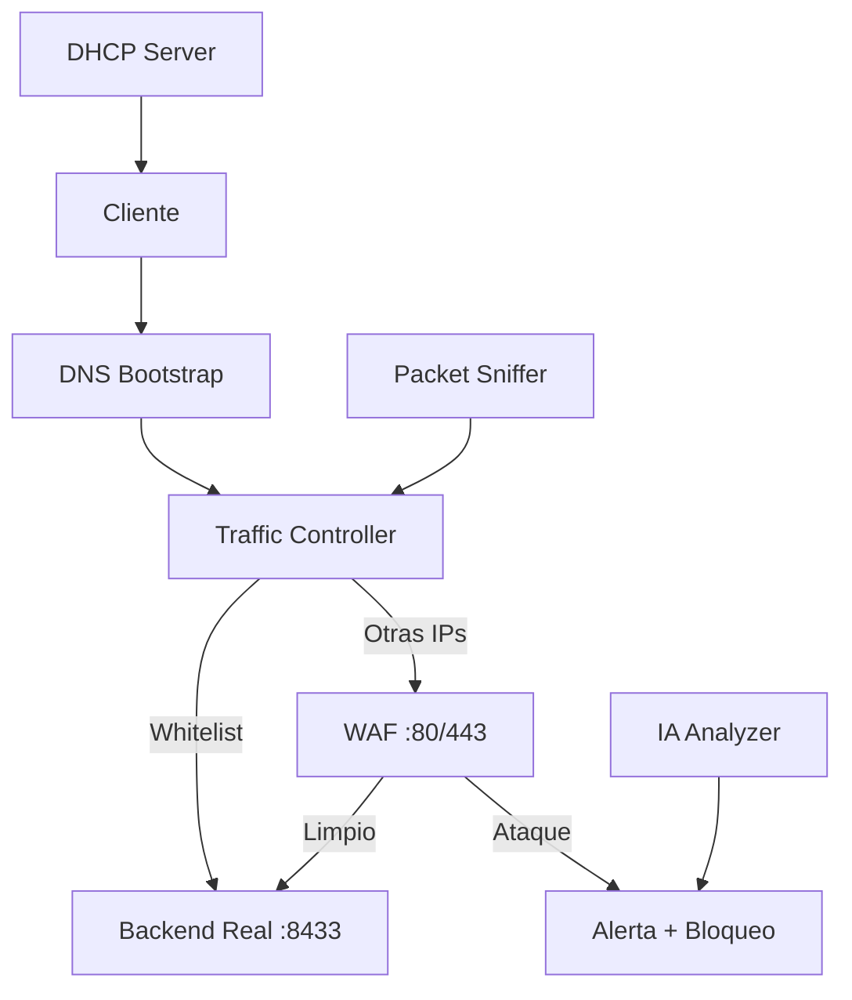

# 🛡️ Sistema de Ciberseguridad Empresarial

[](LICENSE)
[](https://www.python.org/)
[](https://fastapi.tiangolo.com/)
[](CONTRIBUTING.md)

> Plataforma unificada de seguridad para redes pequeñas/medianas con servidor DHCP, DNS, WAF, Traffic Controller y detección de anomalías con IA.

## 📋 Tabla de contenidos
- [Características](#-características)
- [Arquitectura](#-arquitectura)
- [Requisitos](#-requisitos)
- [Instalación rápida](#-instalación-rápida)
- [Configuración](#-configuración)
- [Uso](#-uso)
- [Panel de administración](#-panel-de-administración)
- [Documentación](#-documentación)
- [Contribuir](#-contribuir)
- [Licencia](#-licencia)

## ✨ Características
- **DHCP Server** – Asignación automática de IPs y entrega de DNS personalizado.
- **DNS Bootstrap** – Resolución de dominio local (`ciberseguridad.local`).
- **Traffic Controller** – Decisión inteligente de redirección (Admin / WAF).
- **WAF (Web Application Firewall)** – Protección contra SQLi, XSS, Path Traversal, etc.
- **Packet Sniffer** – Captura y análisis de tráfico en tiempo real.
- **IA Anomaly Detection** – Isolation Forest para detectar comportamientos anómalos.
- **Panel de administración** – Control total desde una interfaz web moderna.
- **Agentes remotos** – Módulos de seguridad distribuidos en endpoints.
- **Gestor de contraseñas** – Almacenamiento cifrado de credenciales.
- **Multiplataforma** – Windows, Linux y macOS.

## 🏗️ Arquitectura
Incluye un diagrama ASCII o una imagen de la arquitectura. Puedes usar Mermaid para generar diagramas en Markdown.
markdown



## 📦 Requisitos
- Python 3.10 o superior
- Windows/Linux/macOS
- Permisos de administrador/root (para puertos 53, 67)
- Dependencias listadas en `requirements.txt`

## 🚀 Instalación rápida
```bash
git clone https://github.com/tu-usuario/ciberseguridad.git
cd ciberseguridad
python -m venv venv
source venv/bin/activate  # o venv\Scripts\activate en Windows
pip install -r requirements.txt
python server/main.py
```

## ⚙️ Configuración

Copia los archivos de ejemplo y ajústalos:
```bash

cp server/config/*.example server/config/
cp agent/config.ini.example agent/config.ini
Edita los archivos con tus valores
```

## 🖥️ Panel de administración

Accede a https://localhost:8433/panel/admin (usuario: admin, contraseña: la generada en la primera ejecución).
## 📚 Documentación

    Wiki

    API Docs

## 🤝 Contribuir

Lee CONTRIBUTING.md para detalles sobre nuestro código de conducta y el proceso de envío de pull requests.
📄 Licencia

Este proyecto está bajo la licencia MIT. Consulta el archivo LICENSE para más información.

⭐ Si este proyecto te ha sido útil, ¡dame una estrella!